# Adaptive Widescreen screenshots

## Centered screens and advisor pages

City controls stay at the top left. The title and separate menus center on
the canvas independently:

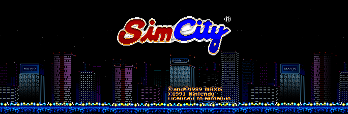

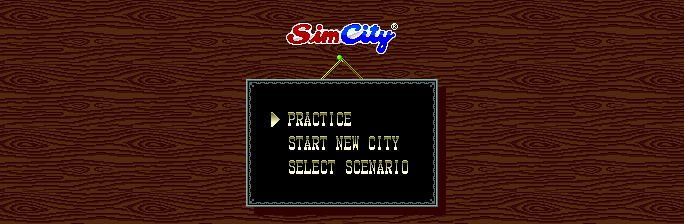

Advisor/tutorial pages also center, while the dimmed city keeps its gameplay
position. Removing the old panel's clipping window exposes the city beneath
it, and the page's original black lettering and portrait stay intact:

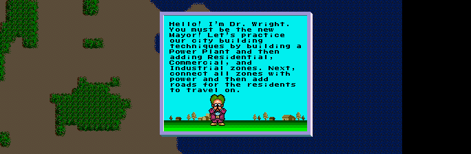

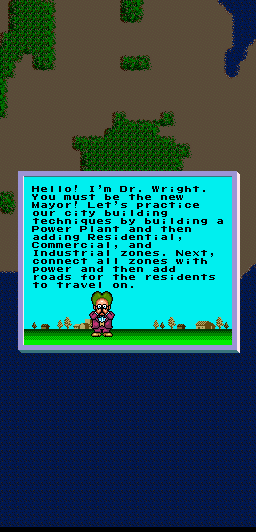

These captures come from `tools/test_adaptive_layout.py`, using normal inputs
through boot, fax, tutorial and gameplay. They are unscaled logical pixels.

## Regression follow-up and left-aligned controls

Captured from the SDL3 build at `a9cddae`, after integrating main `28c280b`.
The same running instance was resized from 1440x405 to 600x900. These are
unscaled logical canvas captures; the game presents them with the selected
pixel aspect. The toolbar stays at the top left as the map expands.

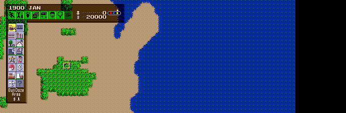

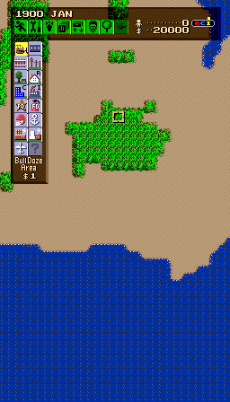

The title lights, scenario cards, fax desk and populated-city roofs:

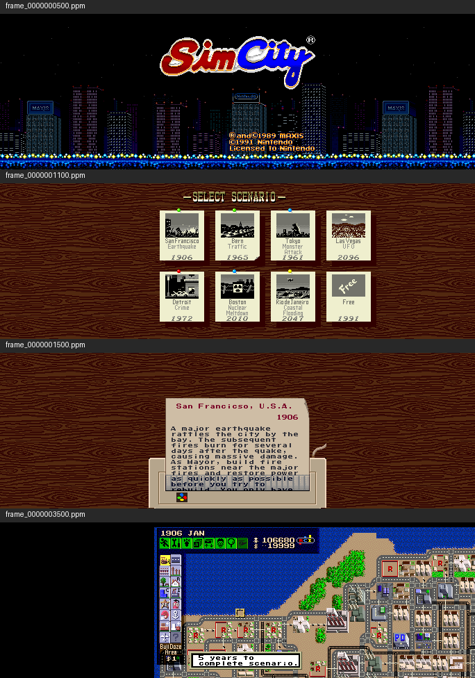

## Original draft (historical)

Captured from the Windows SDL3 build of implementation commit `67e98bd`.
Gameplay images are direct captures of the game window's client area. The
Mods image comes from the shared launcher's screenshot hook. ROMs and local
emulator snapshots are not included.

**Adaptive Fit, wide window:** 1440x405 window, 684x224 logical canvas.
The entire original view stays centered while additional terrain fills the sides.

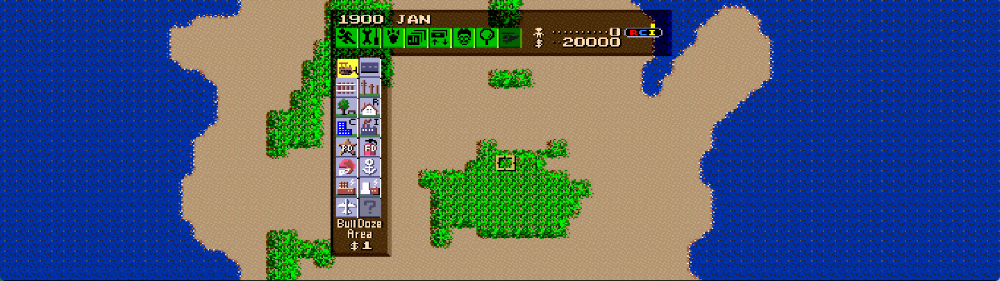

**Adaptive Fit, portrait window:** the same running instance resized to
600x900, with a 256x448 logical canvas. The original view stays visible while
more of the map appears above and below it.

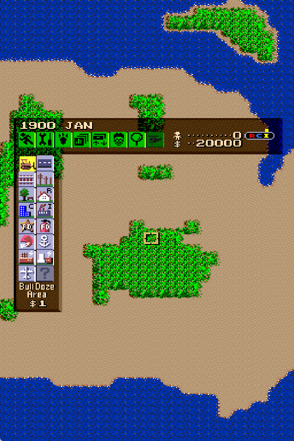

**Fixed 21:9:** San Francisco after normal camera panning, in a 1260x540
window with a 448x224 logical canvas. Terrain and buildings extend past the
native view; game-emitted controls and actors retain their original bounds.

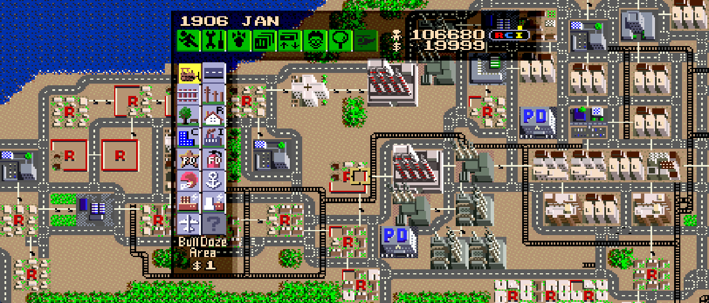

**Shared recomp-ui Mods controls:** the built-in feature enabled with 21:9
selected and the original view centered.

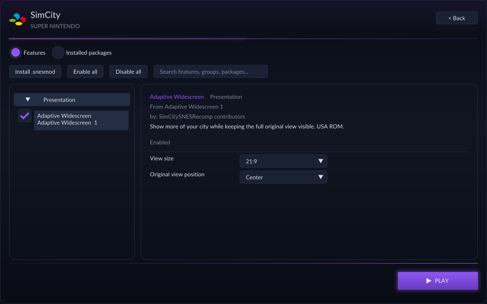

The images in this historical section show the original draft. The current
independent menu/advisor centering is shown above; see
[renderer scope and validation](../../ADAPTIVE_RENDERER.md).
